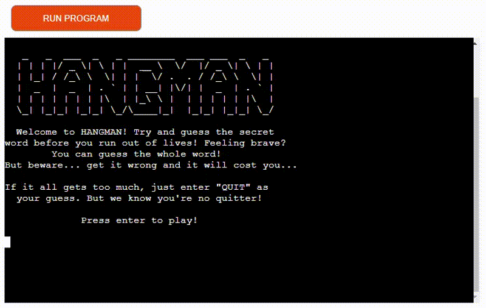
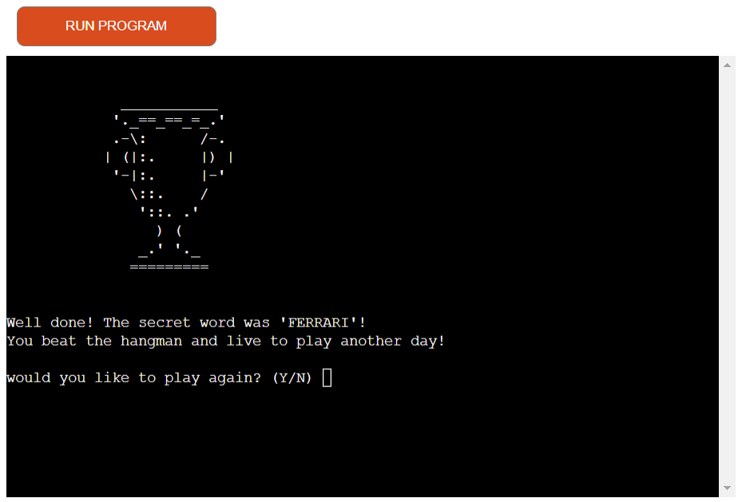
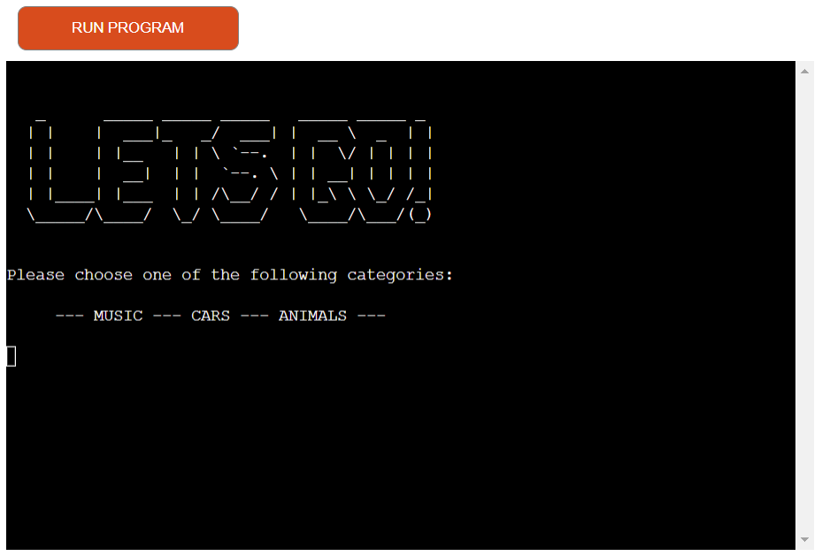
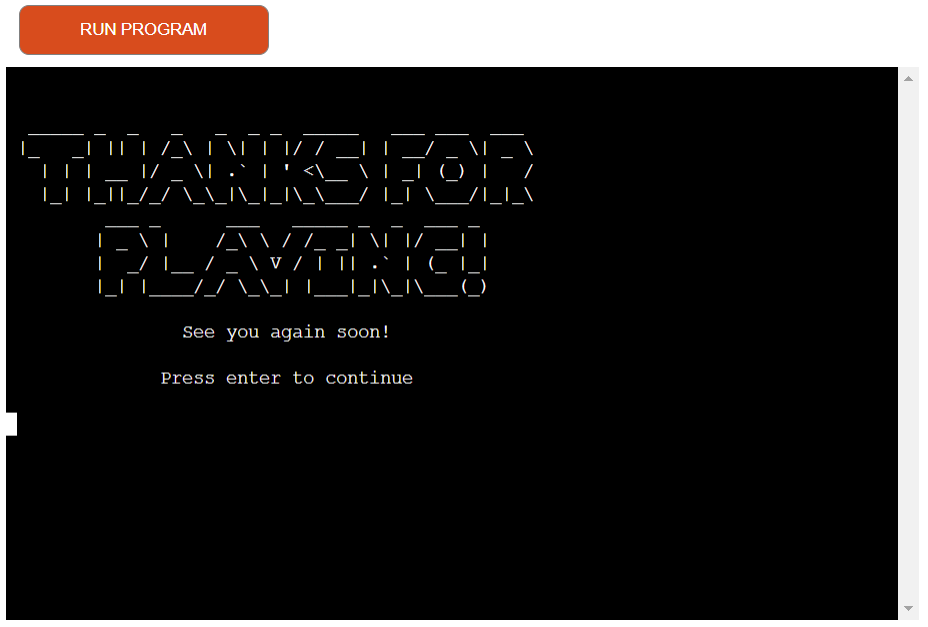
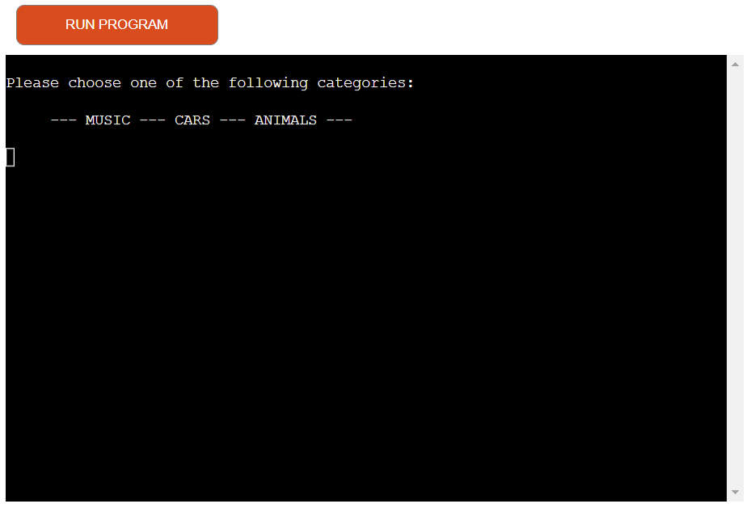
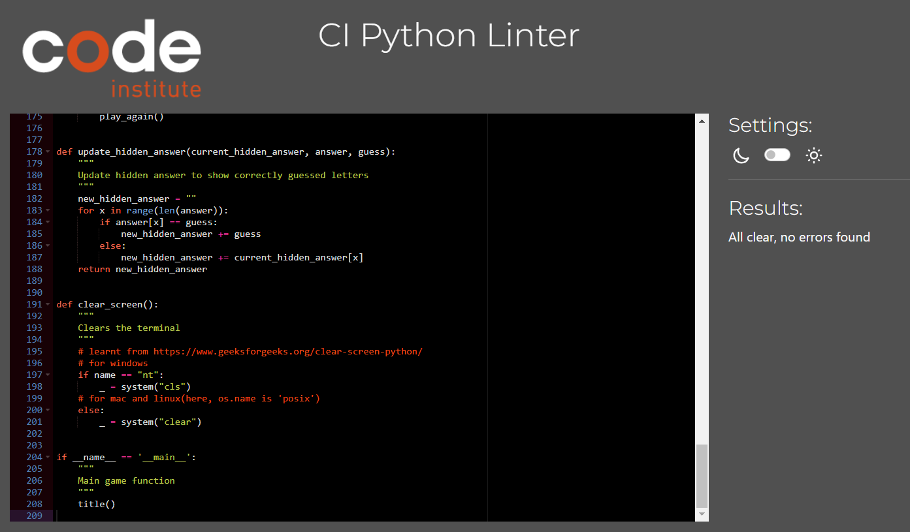

# Hangman

This is a hangman game with multiple categories including Music, Cars and Animals.

Visit the live website:

[Visit Hangman](https://tomhall-hangman-d11ad0eae5ff.herokuapp.com/)

## Contents

- [How to Play](#how-to-play)

- [Design](#design)

  - [Features](#features)
  - [Future Development](#future-development)

- [Technologies Used](#technologies-used)

  - [Languages Used](#languages-used)
  - [Libraries & Programmes Used](#libraries--programs-used)

- [Deployment & Local Development](#deployment--local-development)

  - [Deployment](#deployment)
  - [How to Fork](#how-to-fork)
  - [How to Clone](#how-to-clone)

- [Testing](#testing)

  - [CI Python Linter](#ci-python-linter)
  - [Manual Testing](#manual-testing)
  - [Resolved Bugs](#resolved-bugs)
  - [Known Bugs](#known-bugs)

- [Credits](#credits)

  - [Troubleshooting & Reference Resources](#troubleshooting--reference-resources)
  - [Ascii](#ascii)

- [Acknowledgments](#acknowledgments)

## How to Play

The player chooses a category from Music, Cars or Animals and then is presented with a secret word. In 6 attempts or less, the player can guess individual letters or the entire word. Once the player has successfully guessed the word(s) without using all of their lives, they win! For every incorrect guess the player loses a life and the charachter begins to appear on the gallows. If the player incorrectly guesses the word(s) 2 lives are lost and the gallows move forward by 2. if all lives are lost without the word being guessed, the game is over. The user can quit at any time by entering "QUIT" as a guess.

Winning message:

Losing message:

If the user opts to play again they will se the below message and be given the option to select a different category:

Should the user decide to not play again, they will see the below message:

This will then ask them to press enter to return to the main menu.

## Design

I wanted a simple and intuitive hangman game which while fun, gave the user the opportunity to challenge themselves. I feel I have achieved this by offering a selection of categorys and also giving the user the opportunity to guess the word in its entirety at any point.

The process was planned using LucidChart as below:

Initially, the only guesses that would be valid were letters. After consideration I decided to allow a space as a guess alongside any spaces. I have also made sure that if the user guesses a space it is subject to the same validation and is not repeated. The user can also guess every letter of the word and not guess the space and still win. Equally, should the user randomly guess a space when it is not in the answer, it will count as an incorrect guess. This is something that I like which does not penalise a cheeky guess that you can tell will be there, and at the same time does not take away from the game.

### Features

- Category selection. Choose from music, cars or animal categories to generate your secret word.
  
- Guess individual letters or the entire word.
- Quit at any time by entering "QUIT" as your guess.

### Future Development

- Additional categories.
- A "random" function which will take a word at random from all categories.
- Time limits on guesses or a timed mode, where the player only has a finite amount of time to guess the word.

## Technologies Used

### Languages Used

The application has been created entirely in Python.

### Libraries & Programs Used

Git - For version control.

[Github](https://github.com/) - To save and store the files for the website.

[Heroku](https://dashboard.heroku.com/apps) - To deploy website.

## Deployment & Local Development

### Deployment

Heroku has been used to deploy the live website. The instructions to achieve this are below:

Log into Heroku. Select settings and enter app name. Select build packs for Python and Node.js. Select Deploy and under Deployment Method, select GitHub. Connect to GitHub repository.
Once connected, select Automatic Deploys so each push to GitHub will deploy on live site.

### How to Fork

To fork the GitHub hangman repository:

Log in (or sign up) to Github.
Go to the repository for this project, tomhall82/hangman.
Click the Fork button in the top right corner.

### How to Clone

To clone the hangman repository:

Log in (or sign up) to GitHub.
Go to the repository for this project, tomhall82/hangman.
Click on the code button, select whether you would like to clone with HTTPS, SSH or GitHub CLI and copy the link shown.
Open the terminal in your code editor and change the current working directory to the location you want to use for the cloned directory.
Type 'git clone' into the terminal and then paste the link you copied in step 3. Press enter.

The link to the repository can be found here - [https://github.com/tomhall82/hangman/](https://github.com/tomhall82/hangman/)

## Testing

### CI Python Linter

Passed with no errors found.

### Manual Testing

| Feature                                                                                                           | Expected Outcome                                                                                                                   | Testing Performed                                                                                                                                               | Result                                                                                                    | Pass/Fail |
| ----------------------------------------------------------------------------------------------------------------- | ---------------------------------------------------------------------------------------------------------------------------------- | --------------------------------------------------------------------------------------------------------------------------------------------------------------- | --------------------------------------------------------------------------------------------------------- | --------- |
| Press enter to begin game                                                                                         | Game begins                                                                                                                        | Game launched and multiple keys pressed including enter                                                                                                         | Game begins                                                                                               | Pass      |
| Category selection                                                                                                | User enters "music" and the game launches using a word from the music category                                                     | Multiple tests selecting the music category with a print function to show the word generated so this could be cross referenced against the relevant word file   | Game launched with a word from the music category each time                                               | Pass      |
| Category selection                                                                                                | User enters "cars" and the game launches using a word from the cars category                                                       | Multiple tests selecting the cars category with a print function to show the word generated so this could be cross referenced against the relevant word file    | Game launched with a word from the cars category each time                                                | Pass      |
| Category selection                                                                                                | User enters "animals" and the game launches using a word from the animals category                                                 | Multiple tests selecting the animals category with a print function to show the word generated so this could be cross referenced against the relevant word file | Game launched with a word from the animals category each time                                             | Pass      |
| Category selection                                                                                                | User enters something other than "music", "cars" or "animals" and an error message is generated                                    | Multiple tests inputing various incorrect combinations of letters, numbers and special characters                                                               | User is shown an error message and asked to input another choice                                          | Pass      |
| Game reveals correct guesses                                                                                      | When the correct letter is guessed, this letter is revealed within the secret word                                                 | Using a print statement to show the correct answer both correct and incorrect guesses used as input                                                             | When a correct letter was entered the letter appeared in the secret word                                  | Pass      |
| Lose 1 life and figure appearing in gallows by one stage for incorrect letters guessed                            | When an incorrect letter is guessed, 1 life is deducted and a single stage added to the figure in the gallows.                     | Using a print statement to show the correct answer both correct and incorrect letters used as input                                                             | When an incorrect letter was entered the lives reduced by 1 and figure in the gallows reacted as expected | Pass      |
| Lose 2 lives and figure appearing in gallows by two stages for incorrect words guessed                            | When an incorrect word is guessed, 2 lives are deducted and two stages added to the figure in the gallows.                         | Using a print statement to show the correct answer both correct and incorrect words used as input                                                               | When an incorrect word was entered the lives reduced by 2 and figure in the gallows reacted as expected   | Pass      |
| Game logs previous guesses                                                                                        | When the a letter or word is guessed, it is logged in "Previous guesses"                                                           | Game played to monitor guesses to ensure they are logged correctly                                                                                              | All previous guesses, both letters and words logged                                                       | Pass      |
| Win game if correct answer is entered in its entirety                                                             | If the correct answer is entered in its entirety the game ends with the user winning                                               | Using a print statement to show the correct answer the answer was entered in its entirety as the first answer and after both correct and incorrect guesses.     | When the correct answer is entered in its entirety the user wins                                          | Pass      |
| Prompt if the same letter or word is entered twice                                                                | Prompt to guess again if the user enters a word or full answer that they have guessed previously                                   | Both correct and incorrect letters and words entered in multiple play throughs                                                                                  | Prompt came up everytime a letter or word was duplicated                                                  | Pass      |
| Game ends when lives reach zero and figure appears in gallows                                                     | Game ends when lives reach zero and figure appears in gallows                                                                      | Using a print statement to show the correct answer, incorrect guesses were entered as both letters and full words to cause losses                               | Game ended when lives reached zero and figure is fully displayed in gallows                               | Pass      |
| Win or loss screen displays as necessary showing the hidden word and asking user if they would like to play again | Loss or victory screen shows complete with a revealed secret word at the end of the game. User then given the option to play again | Played 10+ games to test                                                                                                                                        | Correct screen appeared after each win or loss and the option to play again is presented                  | Pass      |
| Play game function takes you to the category selection screen if Y is input                                       | If Y is entered when asked to play again then user is taken back to category selection                                             | 10+ games played to test                                                                                                                                        | Directed to category selection when Y was entered following play again prompt on every attempt            | Pass      |
| Play game function takes you to the thank you selection screen if N is input                                      | If N is entered when asked to play again then user is taken the thank you screen                                                   | 10+ games played to test                                                                                                                                        | Directed to thank you screen when N was entered following play again prompt on every attempt              | Pass      |
| Press enter to continue on thank you screen                                                                       | User is prompted to press enter on thank you screen to return to main menu                                                         | 10+ games played to test                                                                                                                                        | Once enter key is pressed, user is returned to main menu                                                  | Pass      |

### Resolved Bugs

1. Unable to select different categories. This was resolved during a meeting with my mentor where he identified my naming conventions needed to be improved. With some restructuring to the function everything worked.
1. Unable to enter a space without an error and the game crashing. This was an issue with validation which was recognising that a space is not a letter. This was resolved after a visit to stack overflow, in particular https://stackoverflow.com/questions/59495030/combine-isalpha-and-isspace-into-1-statement which helped me to implement this into my own code. Following this, the game will accept letters and spaces as valid answers.
1. As above, the validation was causing the game to crash if it was receiving an answer it was not expecting. This was due to the structure of the code which was ironed out during a mentor session.
1. Unable to enter full words as answers without the game crashing. This again, was all caused by the same issue as above. Once spaces were allowed and validation corrected, the code worked correctly.
1. Resloved an issue where the play game function would not recognise an incorrect input. For example, a user pressing enter or entering somethign other than yes or no would result in the game responding as if "N" had been entered.
1. Thank you screen causing the game to crash if any other input was received before the enter key was pressed. Resolved by tweaking code to include missed input() function along with a call to the title() function.

### Known Bugs

1. None currently

## Credits

### Troubleshooting & Reference Resources

- [stackoverflow](https://stackoverflow.com/)
- [geeksforgeeks.org](https://www.geeksforgeeks.org/)

### Ascii

- Ascii font courtesy of [Text to ASCII Art Generator (TAAG)](https://patorjk.com/software/taag/#p=display&f=3D%20Diagonal&t=Type%20Something)
- Ascii trophy courtesy of [ASCII ART](https://ascii.co.uk/art/trophy)

## Acknowledgments

- [Graeme Taylor](https://github.com/G-Taylor), my Code Institute mentor.
