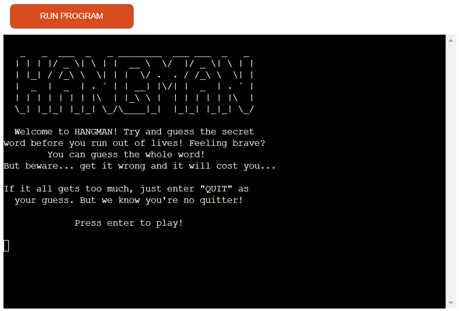

#Hangman

This is a hangman game with multiple categories including Music, Cars and Animals.

Visit the live website:

[Visit Hangman](https://tomhall-hangman-d11ad0eae5ff.herokuapp.com/)

## Contents

- How to play

## How to play

The player chooses a category from Music, Cars or Animals and then is presented with a secret word. In 6 attempts or less, the player can guess individual letters or the entire word. Once the player has successfully guessed the word(s) without using all of their lives, they win! For every incorrect guess the player loses a life and the charachter begins to appear on the gallows. If the player incorrectly guesses the word(s) 2 lives are lost and the gallows move forward by 2. if all lives are lost without the word being guessed, the game is over.

## Design

### Features

### Future development

- Additional categories.
- A "random" function which will take a word at random from all categories.
- Time limits on guesses or a timed mode, where the player only has a finite amount of time to guess the word.

## Technologies Used

### Languages Used

The application has been entirely created in Python.

### Libraries & Programs Used

Git - For version control.

[Github](https://github.com/) - To save and store the files for the website.

[Heroku](https://dashboard.heroku.com/apps) - To deploy website.

## Deployment & Local Development

### Deployment

Heroku has been used to deploy the live website. The instructions to achieve this are below:

### How to Fork

To fork the GitHub hangman repository:

Log in (or sign up) to Github.
Go to the repository for this project, tomhall82/rock-paper-scissors-plus.
Click the Fork button in the top right corner.

### How to Clone

To clone the hangman repository:

Log in (or sign up) to GitHub.
Go to the repository for this project, tomhall82/hangman.
Click on the code button, select whether you would like to clone with HTTPS, SSH or GitHub CLI and copy the link shown.
Open the terminal in your code editor and change the current working directory to the location you want to use for the cloned directory.
Type 'git clone' into the terminal and then paste the link you copied in step 3. Press enter.

The link to the repository can be found here - [https://github.com/tomhall82/hangman/](https://github.com/tomhall82/hangman/)

## Testing
